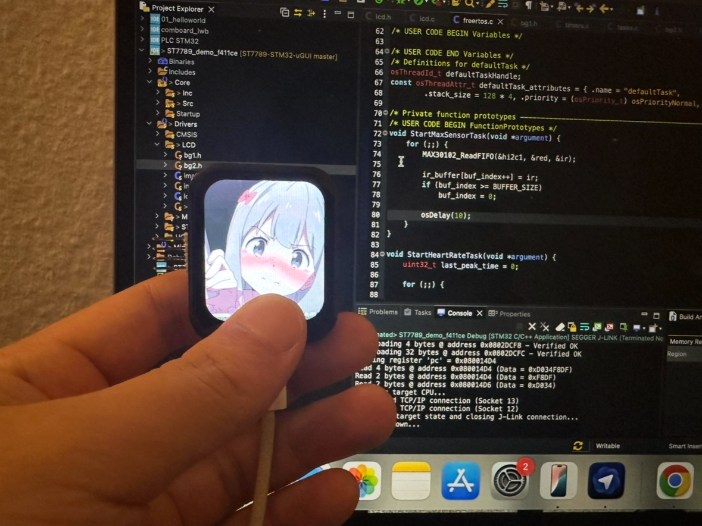
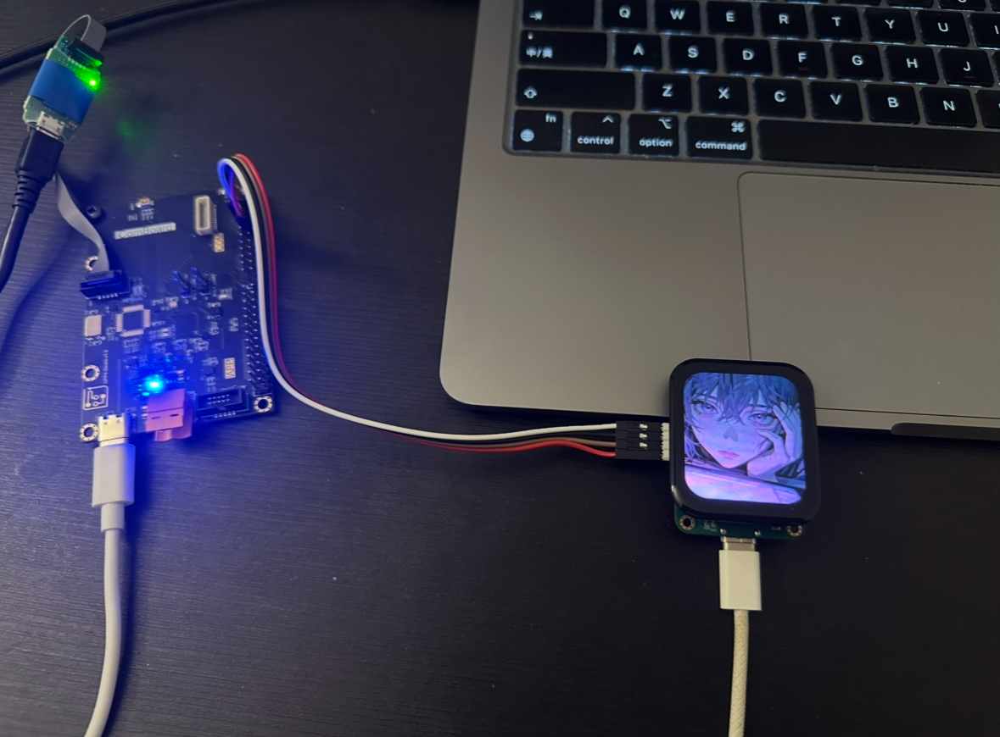
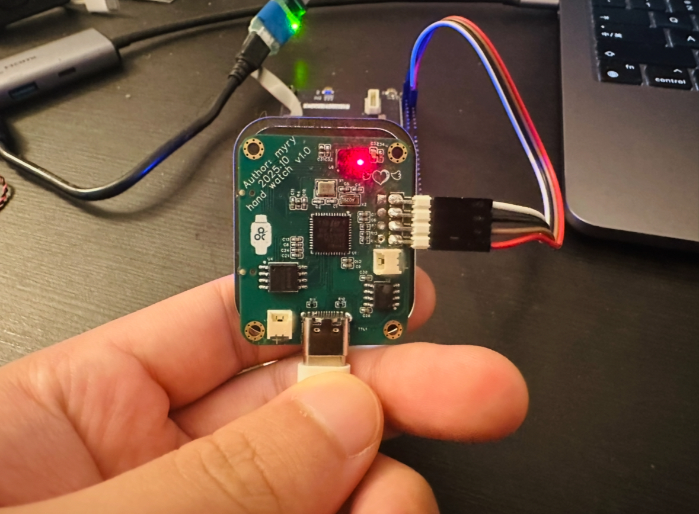
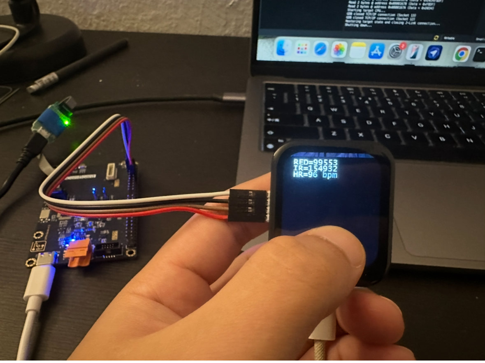

# stm32f411ceu6-hand-watch

##
* MCU: stm32f411ceu6
* LCD: st7789
* SPK: MAX98357
* PPG: MAX30102
* PMIC: AXP2101

I just ran the example code to test the peripherals. Source code from: https://github.com/deividAlfa/ST7789-STM32-uGUI

    

    

    

    

